# Alvazarito - Sistema de Gestión de Inventarios

**Alvazarito** es una aplicación de escritorio robusta diseñada para la gestión eficiente de inventarios, almacenes y usuarios. El proyecto ha sido desarrollado siguiendo los principios de **Clean Architecture**, garantizando un sistema escalable, mantenible y altamente testeable.

---

## ⚙️ Arquitectura del Proyecto
La aplicación está construida bajo la **Onion Architecture** (Arquitectura de Cebolla), lo que permite que el núcleo del negocio sea independiente de las herramientas externas como la base de datos o la interfaz de usuario.

* **Dominio (Core):** Contiene las entidades de negocio (`Producto`, `Almacen`, `Usuario`) e interfaces de repositorios. Es el corazón del sistema y no tiene dependencias externas.
* **Aplicación (Use Cases):** Orquesta la lógica de negocio. Aquí se encuentran acciones como `CreateProducto`, `ValidateLogin` o `GenerateReport`.
* **Infraestructura:** Implementaciones técnicas de los repositorios utilizando **ORMLite** para la persistencia en **SQLite** y servicios de criptografía (**MD5**).
* **Presentación:** Interfaz de usuario desarrollada en **JavaFX**, utilizando el patrón **MVP (Model-View-Presenter)** para separar la lógica de la vista del estado de la UI.

---

## 🚀 Funcionalidades Principales
* **Seguridad y Acceso:** Autenticación de usuarios con contraseñas cifradas en **MD5** y control de acceso basado en roles (`ADMINISTRADOR`, `ALMACEN`, `PRODUCTOS`).
* **Gestión de Almacenes:** Registro, edición y visualización de ubicaciones físicas. Incluye validación de integridad referencial (no se eliminan almacenes con stock).
* **Control de Inventario:** Gestión completa de productos con trazabilidad (quién modificó y cuándo).
* **Auditoría Integrada:** Registro automático de fechas de creación y última modificación en cada movimiento.

---

## 📸 Vista Previa del Sistema

### 1. Acceso al Sistema (Login)
La puerta de entrada segura que valida credenciales y asigna permisos según el rol del empleado mediante hashing MD5.
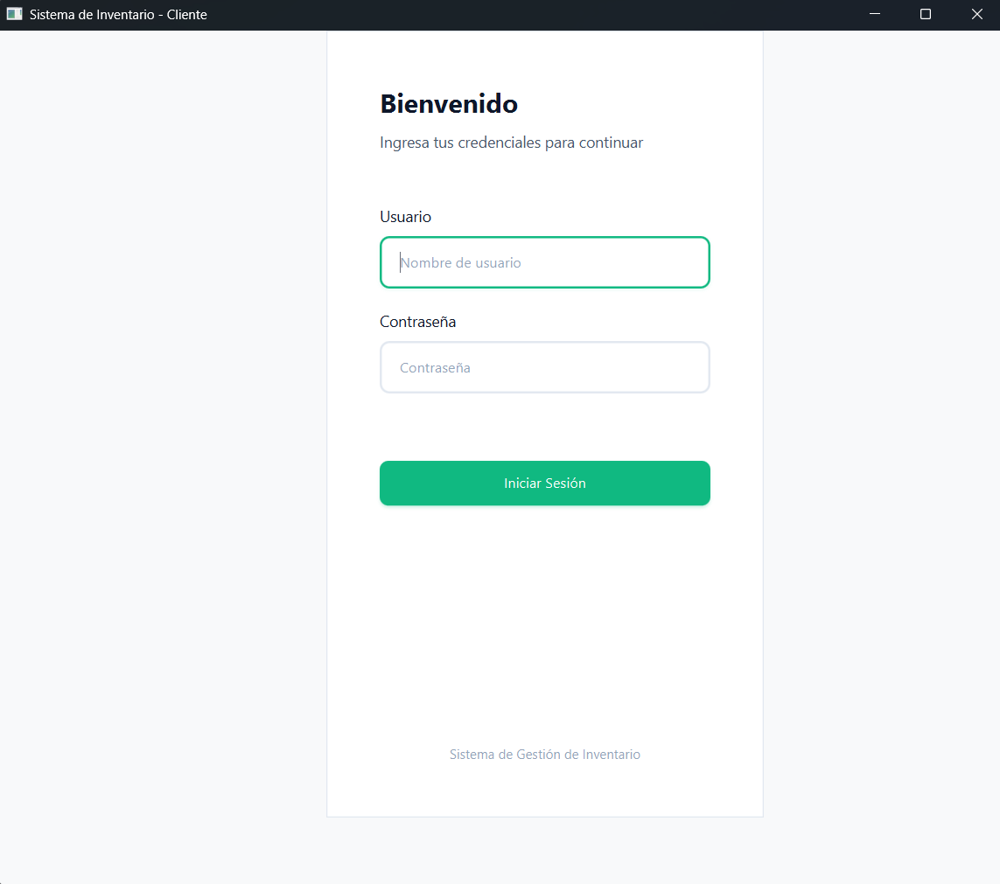

### 2. Panel Principal (Home)
Vista general que permite la navegación rápida entre los módulos de Almacenes, Productos y Usuarios.
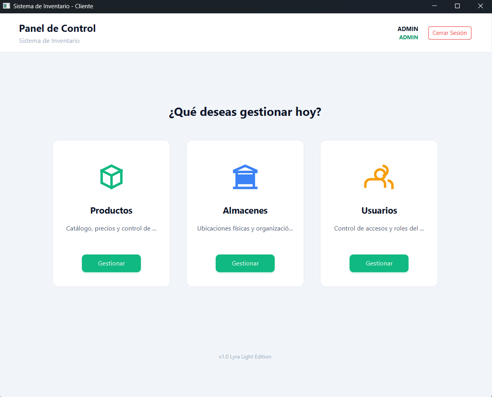

### 3. Catálogo de Productos
Módulo central para la gestión de artículos, precios, existencias y departamentos con filtros en tiempo real.
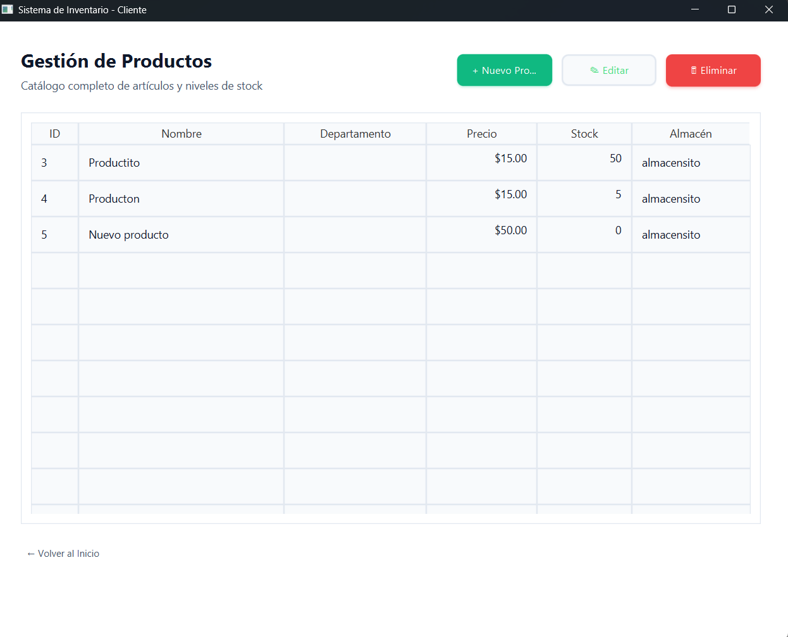

### 4. Gestión de Almacenes
Administración de las sedes físicas o secciones de inventario, visualizando la ubicación y fecha de registro.
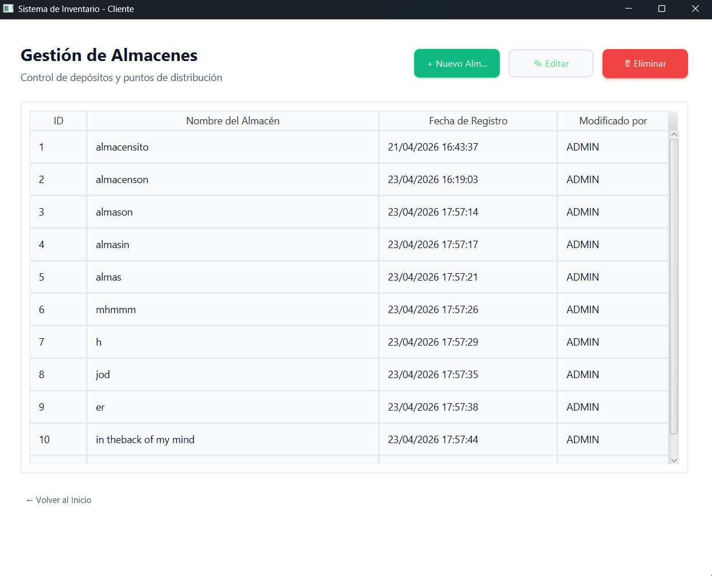

### 5. Control de Usuarios
Panel exclusivo para administradores donde se gestiona el personal y sus niveles de acceso (Roles).
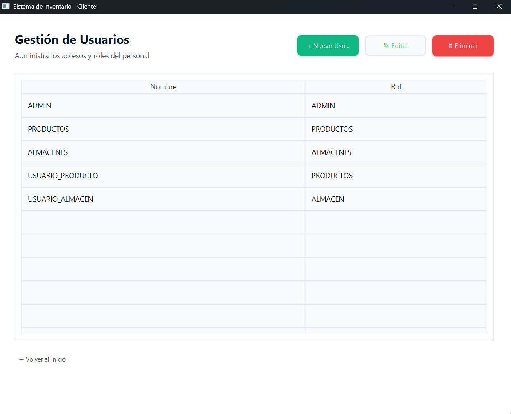

### 6. Diálogos de Gestión (Dialogs)
Interfaces modales optimizadas para la creación y edición de registros con validaciones de campo inmediatas.

| Creación | Modificación |
| :--- | :--- |
| 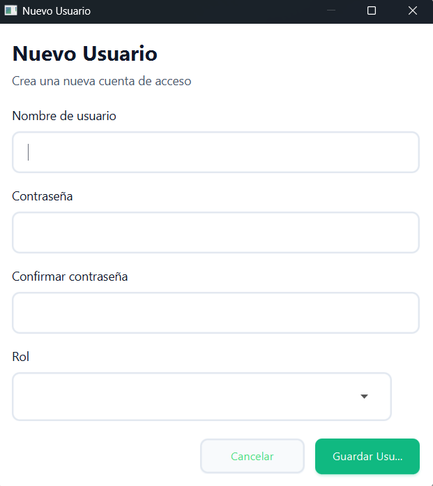 | 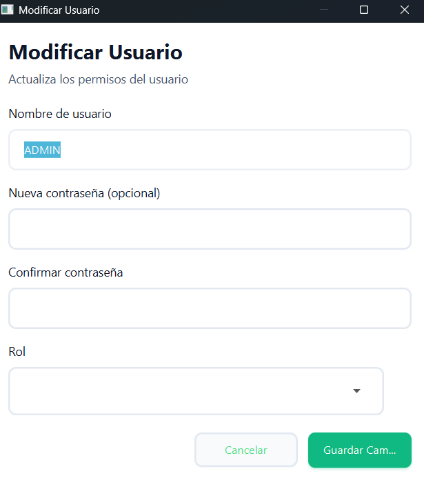 |
| 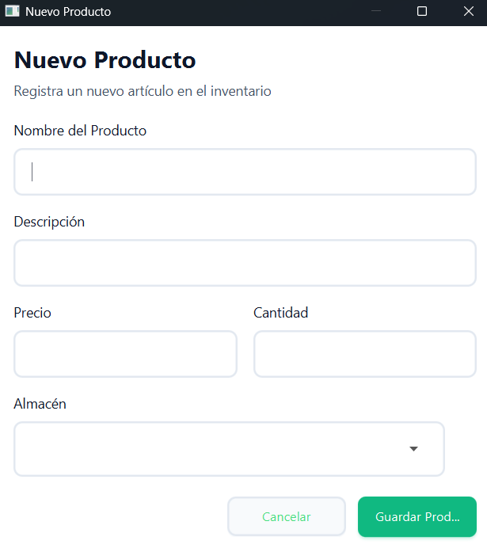 | 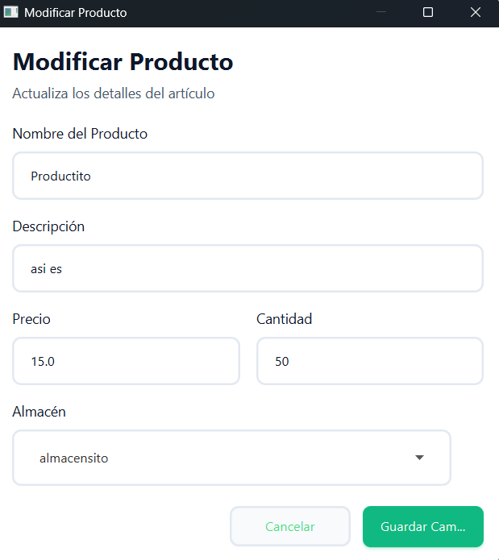 |
| 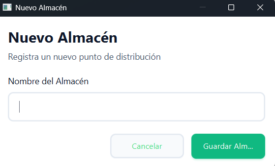 | 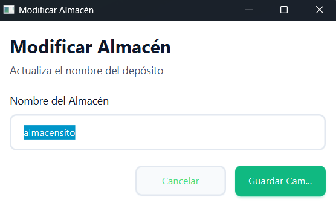 |

---

## 🛠️ Tecnologías Utilizadas
* **Lenguaje:** Java 17+
* **Interfaz Gráfica:** JavaFX (con Scene Builder)
* **Persistencia:** SQLite + ORMLite
* **Arquitectura:** Clean Architecture / MVP
* **Gestión de Dependencias:** Maven
* **Pruebas:** JUnit 5 (Suite de 80 pruebas unitarias y de seguridad)

---

## 🧪 Pruebas y Calidad
El proyecto cuenta con una cobertura de pruebas exhaustiva que incluye:

* **Tests de Dominio:** Validación de reglas de negocio e integridad referencial.
* **Tests de Seguridad:** Prevención de SQL Injection y cifrado de credenciales.
* **Tests de Navegación:** Control de sesiones y permisos por rol.

---
*Desarrollado por Octavio Zenil Lopez - 2026*